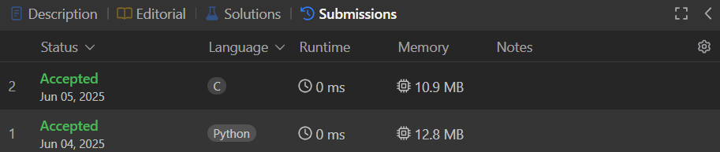

# 496. Next Greater Element 1

**Difficulty:** *Easy*  
**Category:** *Array, Hash Table, Stack, Monotonic Stack*  
**Leetcode Link:** https://leetcode.com/problems/next-greater-element-i/description/

---

## 📝 Introduction

*The next greater element of some element x in an array is the first greater element that is to the right of x in the same array.*

*In this problem, we are given two distinct 0-indexed integer arrays nums1 and nums2, where nums1 is a subset of nums2.*

*For each 0 <= i < nums1.length, we have to find the index j such that nums1[i] == nums2[j] and determine the next greater element of nums2[j] in nums2. If there is no next greater element, then the answer for this query is -1.*

*Then we have to return an array ans of length nums1.length such that ans[i] is the next greater element as described above.*

---

## 💡 Approach & Key Insights

*Step 1: Initialize helper structures.  
Step 2: Traverse nums2 to build next greater mapping.  
Step 3: Use the stack to find next greater elements.  
Step 4: Push the current number onto the stack.  
Step 5: Any elements left in the stack doesn’t have a next greater.  
Step 6: Build result for nums1 using the map.*

---

## 🛠️ Breakdown of Approach Used

### Optimized Approach

- **Explanation:** *The algorithm uses a single pass over nums2 to compute the next greater element for every number using a monotonic decreasing stack.  
Each number is pushed and popped from the stack at most once.  
Lookup for each nums1 element is done in constant time using the next_greater dictionary.*
- **Time Complexity:** *O(n+m) - Linear time based on the input sizes.*
- **Space Complexity:** *O(m) - For stack and hashmap used for caching next greater elements.*
- **Example/Dry Run:** 

Example Input: [4,1,2], [1,3,4,2].  
Output: [-1,3,-1]

---

Author: Daniel Nallapalli  
Date: 9th June 2025